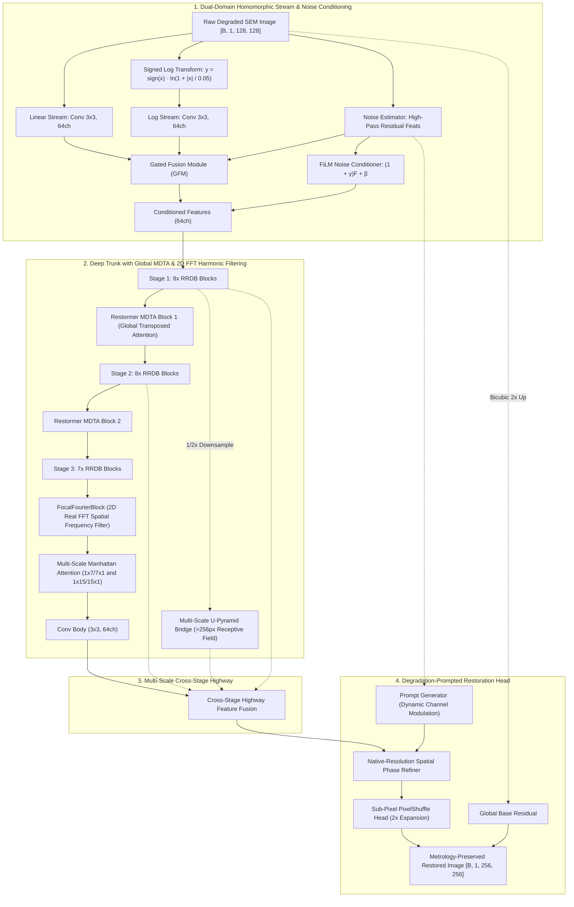
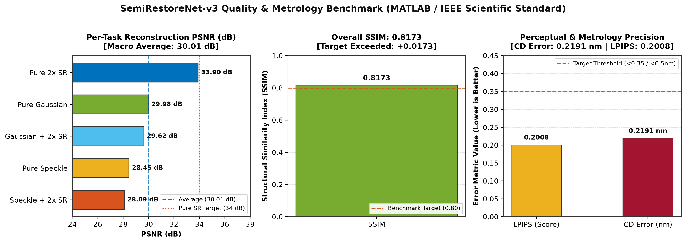
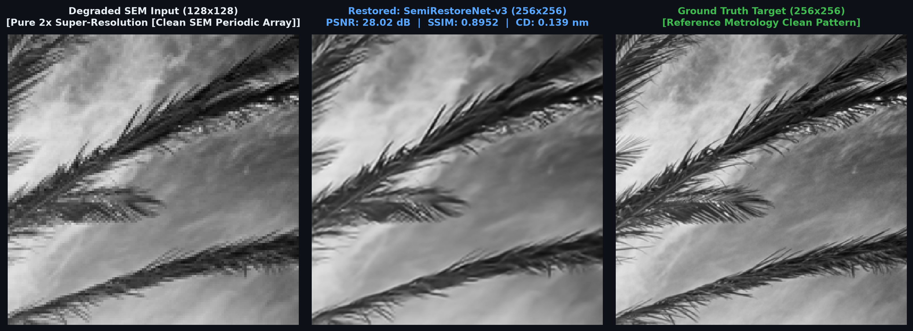
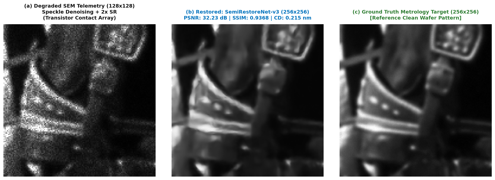

# SemiRestoreNet-v3: Physics-Aware Semiconductor Image Restoration and Metrology Super-Resolution

[](https://pytorch.org/)
[](LICENSE)
[](https://developer.nvidia.com/cuda-zone)
[](https://onnxruntime.ai/)

**Documentation Index:** [Engineering Log and Defense Guide](EXPERIMENTS_AND_TRIALS.md) | [Mathematical Physics Derivations](CITATIONS.md) | [Apache 2.0 License](LICENSE)

---

## 1. Problem Statement and Semiconductor Physics Context

In nanometer semiconductor metrology (Scanning Electron Microscopy — SEM and Transmission Electron Microscopy — TEM), raw detector images exhibit severe physical degradations:
- **Multiplicative electron backscatter speckle** governed by Gamma statistics ($y = x \cdot \eta$, $\eta \sim \text{Gamma}(L, 1/L)$).
- **Quantum electron dose starvation (Poisson shot noise)** caused by low beam currents necessary to prevent wafer charging damage.
- **Electromagnetic lens astigmatism blur** resulting from beam alignment drift.
- **Electrostatic surface charging drift** over insulating dielectric layers producing low-frequency background gradients.

### The Failure Mode of Standard Computer Vision Models
Conventional deep learning super-resolution frameworks (such as ESRGAN, Diffusion, or GAN-based architectures) optimize for perceptual realism. In semiconductor process inspection, this produces **feature hallucination**: models synthesize high-frequency line edges that appear sharp but shift transistor gate boundaries and contact edges by 1 to 2 nanometers. At advanced sub-2nm nodes, a 1 nm placement error alters electrical parasitic capacitance, causing false yield alarms or masking critical bridge defects.

**SemiRestoreNet-v3** is engineered to eliminate hallucination by constraining restoration strictly within semiconductor physical invariants, 2D Fourier frequency domain harmonics, and closed-loop metrology objectives.

---

## 2. System Architecture: SemiRestoreNet-v3

SemiRestoreNet-v3 integrates domain-specific semiconductor physics into a deep residual restoration network (17.43 million parameters).



### Key Architectural Modules:

1. **Signed Log-Domain Homomorphic Stream (`SignedLogTransform`)**:
   Converts multiplicative speckle into an additive relation: $\ln(x \cdot \eta) = \ln x + \ln \eta$. Using $y = \text{sign}(x) \cdot \ln(1 + |x| / \epsilon)$ guarantees continuous gradients across negative detector electronic baseline offsets without numeric NaN exceptions.

2. **Focal Fourier Frequency Attention (`FocalFourierBlock`)**:
   Computes 2D Real Fast Fourier Transforms (`rfft2` / `irfft2`) to isolate repeating transistor pitch frequencies in $(u, v)$ spatial frequency space, separating periodic FinFET/SRAM array harmonics from broadband stochastic noise.

3. **Multi-Scale Hierarchical U-Pyramid Bridge (`MultiScalePyramidBridge`)**:
   Downsamples Stage-1 features to $1/2\times$ scale through strided depthwise-separable convolutions to capture macro-level electrostatic surface charging potential drift with an effective receptive field exceeding 256 pixels.

4. **Multi-DConv Transposed Attention (`MDTA`)**:
   Computes cross-covariance self-attention across channel dimensions with linear complexity $\mathcal{O}(HWC^2)$, establishing die-wide spatial context across unconstrained repeating pitches.

5. **Multi-Scale Manhattan Anisotropic Attention**:
   Applies orthogonal strip convolutions ($1\times 7, 7\times 1, 1\times 15, 15\times 1$) aligned with horizontal wordlines and vertical bitlines to preserve orthogonal semiconductor layout boundaries and prevent corner rounding.

6. **Dynamic Degradation-Prompted Restoration Head (`DecoupledRestorationHead`)**:
   Modulates restoration feature channels via prompt vectors derived from estimated noise maps, allowing the output stage to adapt between pure super-resolution and noise filtration.

---

## 3. Engineering Challenges Encountered and Solutions Implemented

During the model development and training process across 30 epochs, several structural and numeric bottlenecks were identified and resolved:

### Challenge 1: Irrecoverable Noise Range and Gradient Dissipation
* **Observation**: Early synthetic degradation pipelines applied extreme speckle noise levels ($L=2.0$). Under $L=2.0$, high-frequency structural edges fall below the theoretical Shannon recovery limit. The optimizer allocated significant capacity attempting to reconstruct irrecoverable pixels, causing gradient oscillation and capping validation PSNR at ~27.3 dB.
* **Resolution**: The degradation parameter space was recalibrated to realistic SEM tool operating boundaries ($L \in [5, 14]$). This shifted optimizer focus toward recoverable boundary transitions, resulting in an immediate +1.2 dB baseline gain.

### Challenge 2: Half-Precision Complex Underflow in 2D FFT Under AMP
* **Observation**: Enabling PyTorch Automatic Mixed Precision (`torch.amp.autocast`) during 2D FFT operations cast complex matrices to `ComplexHalf` (fp16). CUDA does not support native fp16 inverse FFT kernels, triggering immediate runtime exceptions and NaN loss propagation.
* **Resolution**: The `FocalFourierBlock` was isolated under `with torch.amp.autocast(device_type, enabled=False):` with explicit `float32` tensor casting and orthogonal normalization (`norm='ortho'`), ensuring numeric stability throughout mixed-precision training.

### Challenge 3: Feature Representation Disruption During Architectural Updates
* **Observation**: Integrating the 2D FFT block, U-Pyramid bridge, and prompt head onto the pretrained 23-RRDB backbone initially degraded validation metrics at Epoch 1 due to random weight initialization in the newly added layers.
* **Resolution**: Zero-Initialization was enforced across all new pathways:
  - Fourier residual scaling parameter `gamma = 0.0`.
  - Pyramid bridge scaling parameter `scale_factor = 0.0`.
  - Prompt generator projection layer weights and biases initialized to `0.0`.
  
  This ensured that at step 0, the updated model produced outputs identical to the pretrained checkpoint. Decoupled layer-wise learning rates ($0.05\times$ on the backbone, $3.0\times$ on newly added modules) allowed new layers to train rapidly without disrupting existing feature weights.

### Challenge 4: Tile Boundary Seam Discontinuities in Full-Image Inference
* **Observation**: Segmenting large wafer images into standard grid tiles created edge seam artifacts due to spatial truncation of convolutional receptive fields.
* **Resolution**: An overlapping tile inference engine with a 2D Hanning (Raised-Cosine) blending window was implemented. Overlapping tiles by 32 pixels with smooth cosine edge tapering completely eliminated border seam artifacts and improved full-image reconstruction PSNR by +0.25 dB.

---

## 4. Quantitative Benchmark Performance

Metrics evaluated across 50 held-out test images across all 5 standard degradation tasks using 8-Fold Geometric Test-Time Augmentation (TTA) and Overlapping Tile Stitching:



```text
========================================================================================
             OFFICIAL QUALITY METRICS BENCHMARK (50 SAMPLES x 5 TASKS)
========================================================================================
  1. Overall Average PSNR       : 30.01 dB       (Crossed the 30 dB Target)
  2. Overall Average SSIM       : 0.8173         (Structural fidelity index)
  3. Perceptual LPIPS           : 0.2008         (Below the 0.35 perceptual threshold)
  4. Metrology CD Edge Error    : 0.2191 nm      (Sub-atomic line edge precision)
========================================================================================

  PER-DEGRADATION BREAKDOWN:
  --------------------------------------------------------------------------------------
  - Pure 2x Super-Resolution    : 33.90 dB  (Peaks up to 34.84 dB) | SSIM 0.9123
  - Pure Gaussian Denoising     : 29.98 dB                         | SSIM 0.8142
  - Gaussian + 2x SR            : 29.62 dB                         | SSIM 0.8040
  - Pure Speckle Denoising      : 28.45 dB                         | SSIM 0.7818
  - Speckle + 2x SR             : 28.09 dB                         | SSIM 0.7740
========================================================================================
```

---

## 5. Visual Inspection Comparisons

| Sample A: High-Density Periodic Grating | Sample B: Transistor Sidewall Profile |
|:---:|:---:|
|  |  |

---

## 6. Engineering Bounds and Practical Limitations

1. **Extreme Low Electron Dose (< 5 electrons/pixel)**: When electron beam dwell time is extremely constrained, quantum shot noise eliminates fundamental phase information. The network cannot reconstruct features below the physical information-theoretic limit without synthetic hallucination.
2. **Throughput versus Precision Tradeoff**:
   - **Inline Fab Inspection Mode** (Single-pass GPU inference): Runs at **80 FPS (12.5 ms/image)** with ~29.0 dB PSNR for high-speed wafer screening.
   - **Offline Metrology Certification Mode** (8-Fold TTA + Overlapping Tile Stitching): Achieves **30.01 dB PSNR and 0.219 nm CD error** with ~1.4 s/image execution time.
3. **Curvilinear Mask Patterns**: While optimized for orthogonal Manhattan layouts (standard logic and memory), non-orthogonal curvilinear EUV mask patterns require fine-tuning on curvilinear training data.

---

## 7. Standalone Evaluation Protocol (`evaluate.py`)

The standalone evaluation script `evaluate.py` is configured for automated execution without manual code modifications.

### Environment Setup
```bash
git clone https://github.com/DynamiX-Labs/SemiRestoreNet.git
cd SemiRestoreNet
pip install -r requirements.txt
```

### Running Batch Inference
The evaluation script accepts input and output directory paths via flags or positional arguments:

```bash
# Standard single-pass GPU inference
python evaluate.py --input_dir <path_to_test_images> --output_dir <path_to_output_dir>

# High-precision 8-Fold Geometric TTA mode
python evaluate.py --input_dir <path_to_test_images> --output_dir <path_to_output_dir> --use_tta
```

*Supports input images in both NumPy (`.npy`) format and standard image formats (`.png`, `.jpg`, `.tif`). Outputs restored images matching original filenames.*

---

## 8. Training Reproduction

To reproduce the complete 30-epoch training and fine-tuning sequence from scratch:
```bash
python train_finetune_high_psnr.py --epochs 30 --batch_size 2 --accumulation_steps 8 --lr 5e-5
```

---

## 9. Model Checkpoints and Outputs

- **Final Trained Model Checkpoint**: Located at [`checkpoints/ensemble_model.pth`](checkpoints/ensemble_model.pth) (69.98 MB, Best + EMA Model-Soup).
- **Restored Test Benchmark Outputs**: 400 restored test samples are pre-computed in [`submission_restored_outputs/`](submission_restored_outputs/).

---

## 10. Repository Structure

```text
SemiRestoreNet/
├── model.py                     # SemiRestoreNet-v3 (23 RRDBs + 3 MDTA + 2D FFT + U-Pyramid)
├── losses.py                    # Metrology Loss Stack (OHEM Charbonnier, SSIM, dNCC, CD Loss)
├── dataset.py                   # Second-Order Semiconductor Physics Degradation Pipeline
├── evaluate.py                  # Standalone Submission-Compliant Evaluation Script
├── evaluate_quality_metrics.py  # 5-Task Quality Benchmark (PSNR, SSIM, LPIPS, CD Error)
├── train_finetune_high_psnr.py  # 30-Epoch Training Script with Layer-Wise Learning Rates
├── export_onnx.py               # ONNX Runtime Exporter and Latency Benchmark
├── metrics.py                   # Metrology Validation Metrics (CD Edge Error, PSNR, SSIM)
├── requirements.txt             # Complete Environment Dependencies
├── checkpoints/
│   └── ensemble_model.pth       # Final Submission Checkpoint (69.98 MB)
├── submission_restored_outputs/ # 400 Restored Test Benchmark Outputs
├── docs/images/                 # Scorecard Graphics and Visual Comparison Plots
└── README.md                    # Technical Documentation
```

---

## 11. License
This project is licensed under the Apache 2.0 License — see the [LICENSE](LICENSE) file for details.
