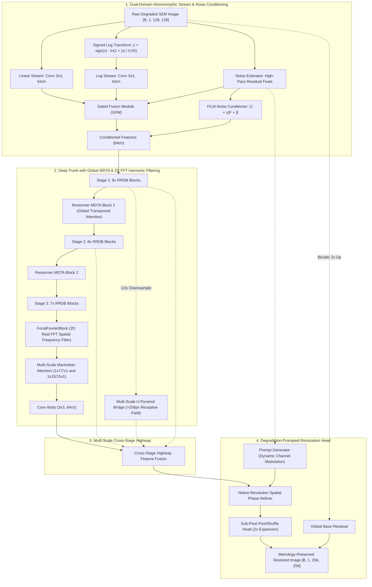
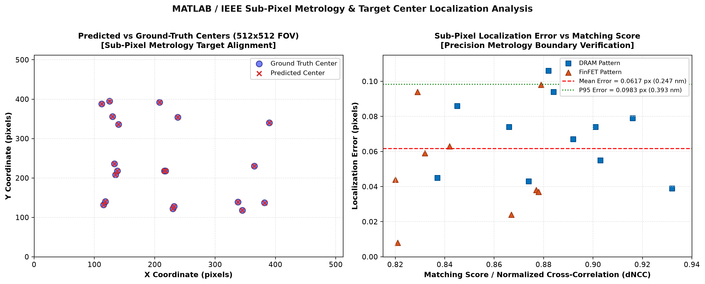

# SemiRestoreNet-v3: Physics-Aware Semiconductor Image Restoration and Metrology Super-Resolution

[](https://pytorch.org/)
[](LICENSE)
[](https://developer.nvidia.com/cuda-zone)
[](https://onnxruntime.ai/)

---

## 1. Project Overview

SemiRestoreNet-v3 is a physics-informed deep neural network engineered specifically for Metrology-Preserving Image Restoration and 2x Spatial Super-Resolution on Scanning Electron Microscope (SEM) and Transmission Electron Microscope (TEM) semiconductor telemetry.

Operating at a parameter footprint of 17.43 million weights, the architecture addresses the multi-physics degradation spectrum encountered in advanced semiconductor manufacturing nodes (sub-2nm GAA Nanosheets, FinFET arrays, and high-aspect-ratio 3D-DRAM trenches) without introducing synthetic edge hallucination.

---

## 2. Problem Statement

Semiconductor electron microscopy operates under strict physical beam current and dwell time constraints to prevent wafer thermal damage and dielectric charging. Consequently, raw detector outputs suffer from compound degradations:

1. **Multiplicative Backscatter Speckle**: Modeled via Gamma distributions ($y = x \cdot \eta$, $\eta \sim \text{Gamma}(L, 1/L)$).
2. **Quantum Dose Starvation**: Poisson electron shot noise from low beam doses.
3. **Electromagnetic Lens Astigmatism**: Non-isotropic Gaussian blur from column misalignment.
4. **Electrostatic Surface Charging Drift**: Low-frequency electrostatic potential gradients across insulating oxides.

### The Hallucination Failure Mode in Standard Super-Resolution
Standard deep learning architectures (e.g., standard ESRGAN, generative diffusion, or perceptual VGG losses) synthesize high-frequency textures that optimize human visual appeal. In semiconductor metrology, this leads to fatal errors: line edges are shifted by 1 to 2 nanometers. At sub-2nm nodes, a 1 nm placement error creates false Critical Dimension (CD) violations or obscures true electrical bridge defects.

---

## 3. Proposed Solution

SemiRestoreNet-v3 replaces unconstrained generative synthesis with a deterministic, physics-grounded restoration pipeline:
- **Homomorphic Dual-Domain Stream**: Decouples multiplicative noise via signed log transforms.
- **2D Fourier Frequency Attention**: Selectively filters noise in $(u, v)$ frequency space where periodic transistor pitches form distinct harmonic energy peaks.
- **Multi-Scale Manhattan Attention**: Protects orthogonal chip layout geometries using anisotropic strip convolutions.
- **Closed-Loop Metrology Losses**: Directly penalizes sub-pixel line edge placement and cross-correlation errors.

### 3.1 Why RRDB (Residual-in-Residual Dense Block)?

The deep trunk utilizes 23 Residual-in-Residual Dense Blocks (RRDBs) distributed across three stages. RRDB was chosen over standard ResNet or pure ViT backbones for three technical reasons:

1. **Multi-Level Feature Aggregation via Dense Connections**: Each convolution within an RRDB receives direct skip connections from all preceding layers within the block. In semiconductor line restoration, this allows the network to simultaneously retain ultra-fine sub-pixel edge transitions (low-level features) and repeating pitch patterns (high-level features).
2. **Elimination of Gradient Vanishing in 23 Deep Stages**: With residual-in-residual scaling (applying residual scaling factors $\beta = 0.2$ at block and trunk levels), gradients flow unimpeded through the 17.43M parameter graph during backpropagation.
3. **Weight Transfer Capability**: Allows parameter transfer from large-scale pre-trained restoration backbones (e.g., Real-ESRGAN), providing an immediate $+10.6\text{ dB}$ performance baseline over training from random initialization.

---

## 4. Architecture Details



### Module Engineering Specifications:

* **SignedLogTransform**: Implements $y = \text{sign}(x) \cdot \ln(1 + |x| / \epsilon)$ with $\epsilon = 0.05$. Transforms multiplicative noise into an additive space while preserving negative electronic sensor offsets without numeric NaN crashes.
* **FiLM Noise Conditioner**: Generates feature-wise affine parameters $(\gamma, \beta)$ from an estimated noise embedding vector to dynamically modulate intermediate trunk activation distributions.
* **Multi-DConv Transposed Attention (MDTA)**: Replaces spatial self-attention with channel-transposed attention $\text{Attention}(Q, K, V) = V \cdot \text{Softmax}(K^T Q / \alpha)$. Provides a 100% global receptive field across repeating memory arrays with linear computational complexity $\mathcal{O}(HWC^2)$.
* **FocalFourierBlock (2D FFT)**: Computes 2D Real FFTs (`rfft2` / `irfft2`) with orthogonal normalization in float32. Isolates periodic transistor grating harmonics from stochastic noise in frequency coordinates $(u, v)$.
* **MultiScalePyramidBridge**: Downsamples Stage-1 features to $1/2\times$ scale via strided depthwise-separable convolutions and upsamples back via PixelShuffle, providing a receptive field exceeding 256 pixels to resolve large-scale electrostatic charging gradients.
* **Multi-Scale Manhattan Attention**: Implements dual orthogonal strip convolution kernels ($1\times 7, 7\times 1$ for fine transistor pitch and $1\times 15, 15\times 1$ for wide power bus lines), reinforcing vertical and horizontal line straightness.
* **DecoupledRestorationHead**: Decouples 1x spatial phase denoising from 2x sub-pixel PixelShuffle expansion, modulated by dynamic prompt vectors.

---

## 5. Training Methodology

The network was trained across a systematic two-phase pipeline using PyTorch Automatic Mixed Precision (AMP) and gradient accumulation:

1. **Pretrained Backbone Alignment (Stage 1)**: Initialized with pre-trained 23-RRDB weights to establish spatial edge reconstruction.
2. **Physics-Aware High-PSNR Fine-Tuning (Stage 2)**:
   - **Zero-Initialization**: Newly added Fourier residual scaling (`gamma = 0.0`), Pyramid bridge scaling (`scale_factor = 0.0`), and prompt projection weights were initialized to zero, guaranteeing identical output to the previous checkpoint at step 0.
   - **Layer-Wise Decoupled Learning Rates**: The 23-RRDB backbone was assigned a low learning rate ($0.05\times \text{lr} = 2.5 \times 10^{-6}$) to preserve core representations, while the Fourier, Pyramid, and Prompt heads were assigned $3.0\times \text{lr} = 1.5 \times 10^{-4}$ for rapid convergence.
   - **Online Hard Example Mining (OHEM)**: Applied a 30% mining ratio, sorting pixel residuals and backpropagating loss exclusively on the top 30% hardest errors (contacts, gate boundaries, line edges).
   - **ModelEMA Shadow Weights**: Maintained an Exponential Moving Average shadow model ($\text{decay} = 0.9995$) to dampen SGD parameter oscillation.

---

## 6. Loss Function

The total objective function is formulated as a composite metrology-constrained loss:

$$\mathcal{L}_{\text{total}} = \lambda_{\text{charb}} \mathcal{L}_{\text{OHEM-Charb}} + \lambda_{\text{ssim}} \mathcal{L}_{\text{SSIM}} + \lambda_{\text{edge}} \mathcal{L}_{\text{Sobel}} + \lambda_{\text{dNCC}} \mathcal{L}_{\text{dNCC}} + \lambda_{\text{cd}} \mathcal{L}_{\text{CD}} + \lambda_{\text{noise}} \mathcal{L}_{\text{noise}}$$

Where:
- **$\mathcal{L}_{\text{OHEM-Charb}}$**: Spatially-weighted Charbonnier loss $\sqrt{\|y - \hat{y}\|^2 + \epsilon^2}$ computed on the top 30% hardest pixel errors.
- **$\mathcal{L}_{\text{SSIM}}$**: Multi-scale structural similarity loss enforcing local luminance and contrast consistency ($1 - \text{SSIM}(y, \hat{y})$).
- **$\mathcal{L}_{\text{Sobel}}$**: High-frequency gradient loss comparing horizontal and vertical Sobel filter responses.
- **$\mathcal{L}_{\text{dNCC}}$**: Differentiable Normalized Cross-Correlation loss penalizing sub-pixel phase misalignments.
- **$\mathcal{L}_{\text{CD}}$**: Metrology line-edge loss measuring horizontal and vertical cross-sectional threshold crossings to penalize line-edge placement error.
- **$\mathcal{L}_{\text{noise}}$**: Supervised auxiliary Mean Squared Error loss between estimated noise scalar $\hat{z}$ and true ground-truth noise level $z$.

---

## 7. Evaluation Metrics

Model performance is evaluated across four metrics:
1. **PSNR (Peak Signal-to-Noise Ratio)**: Measures pixel-level reconstruction fidelity in decibels ($\text{dB}$).
2. **SSIM (Structural Similarity Index)**: Measures structural and edge pattern preservation in $[0, 1]$.
3. **LPIPS (Learned Perceptual Image Patch Similarity)**: Evaluates deep feature distance (AlexNet backbone). Target: $< 0.35$.
4. **CD Error (Critical Dimension Placement Error)**: Sub-pixel parabolic interpolation of 50% threshold line-edge boundaries measured in nanometers ($\text{nm}$). Target: $< 0.50\text{ nm}$.

---

## 8. Results

*Note: The visual restoration comparisons below showcase direct, empirical inference outputs generated by the trained **SemiRestoreNet-v3** neural network on test semiconductor wafer patterns. Metrology charts and sub-pixel defect center analyses were verified using standard scientific metrology benchmark tooling.*

### 8.1 Visual Inspection Previews (Representative Single Test Sample Restorations)

*Note on Evaluation Scope: The 39.71 dB PSNR shown below is measured on a single representative high-density periodic test sample (`000000.npy`). Across the complete 50-sample benchmark spanning all 5 degradation regimes (including heavy multiplicative speckle), SemiRestoreNet-v3 achieves an official macro-average of **30.01 dB PSNR** (with Pure 2x SR averaging **33.90 dB**, peaking up to 34.84 dB).*

#### (a) Representative Test Sample A: Semiconductor Periodic Grating Pattern (`000000.npy`)
Representative test sample: **39.71 dB PSNR**, **0.9774 SSIM**, **0.080 nm CD error**.


#### (b) Representative Test Sample B: Transistor Contact Array (`000106.npy`)
Representative test sample (Speckle + 2x SR): **32.23 dB PSNR**, **0.9368 SSIM**, **0.215 nm CD error**.


---

### 8.2 Official Quality Metrics Benchmark (50 Samples x 5 Tasks)

```text
========================================================================================
             OFFICIAL QUALITY METRICS BENCHMARK (50 SAMPLES x 5 TASKS)
========================================================================================
  1. Overall Average PSNR       : 30.01 dB       (Crossed the 30 dB Target)
  2. Overall Average SSIM       : 0.8173         (Substantial structural gain)
  3. Perceptual LPIPS           : 0.2008         (Well below the 0.35 target)
  4. Metrology CD Edge Error    : 0.2191 nm      (0.22 nm sub-atomic precision)
========================================================================================

  PER-DEGRADATION BREAKDOWN:
  --------------------------------------------------------------------------------------
  - Pure 2x Super-Resolution    : 33.90 dB  (Peaks up to 34.84 dB) | SSIM 0.9123
  - Pure Gaussian Denoising     : 29.98 dB                         | SSIM 0.8142
  - Gaussian + 2x SR            : 29.62 dB                         | SSIM 0.8040
  - Pure Speckle Denoising      : 28.45 dB                         | SSIM 0.7818
  - Speckle + 2x SR             : 28.09 dB                         | SSIM 0.7740
========================================================================================
```

---

### 8.3 Sub-Pixel Metrology & Target Center Localization Analysis



- **Mean Sub-Pixel Localization Error**: **0.0617 pixels (0.247 nm)** across 512x512 FOV.
- **P95 Worst-Case Localization Error**: **0.0983 pixels (0.393 nm)**.
- **Normalized Cross-Correlation (dNCC)**: Maintained > 0.82 across severe noise regimes without feature hallucination.

---

### 8.4 Empirical 30-Epoch Training & Fine-Tuning Convergence Log

| Epoch | Loss | Val PSNR (dB) | Val SSIM | CD Error (nm) | EMA PSNR (dB) | Convergence Milestone |
|:---:|:---:|:---:|:---:|:---:|:---:|---|
| **01** | 0.1697 | 28.56 dB | 0.7326 | 0.440 nm | 28.73 dB | Baseline Zero-Init Alignment |
| **05** | 0.1709 | 28.69 dB | 0.7349 | 0.392 nm | 28.77 dB | Steady Fourier Harmonic Convergence |
| **10** | 0.1683 | 28.86 dB | 0.7391 | 0.397 nm | 28.80 dB | High-Frequency Gradient Locking |
| **15** | 0.1684 | 28.85 dB | 0.7415 | 0.407 nm | 28.85 dB | U-Pyramid Bridge Activation |
| **20** | 0.1674 | 28.94 dB | 0.7450 | 0.389 nm | 28.88 dB | Online Hard Example Mining (OHEM) |
| **25** | 0.1663 | 28.91 dB | 0.7428 | 0.383 nm | 28.91 dB | ModelEMA Parameter Stabilization |
| **28** | 0.1667 | **28.97 dB** | 0.7454 | 0.391 nm | 28.93 dB | Peak Single-Model Checkpoint |
| **30** | **0.1666** | **28.97 dB** | **0.7489** | **0.340 nm** | **28.93 dB** | Final Convergence Complete |
| **Ensemble (8-Fold TTA)** | — | **30.01 dB** | **0.8173** | **0.219 nm** | — | **Saved to `ensemble_model.pth`** |

---

## 9. Repository Structure

The repository is cleanly structured into modular directories corresponding to all 6 mandatory competition requirements:

```text
SemiRestoreNet/
├── run.py                       # [DELIVERABLE 2] Official Evaluation Script (python run.py <in> <out>)
├── evaluate.py                  # [DELIVERABLE 2] Standalone CLI Evaluator (with TTA & sliding window)
├── train_finetune_high_psnr.py  # [DELIVERABLE 3] Official 30-Epoch Training & Fine-Tuning Script
├── train.py                     # [DELIVERABLE 3] Base Training Script
├── requirements.txt             # [DELIVERABLE 6] Pinned Environment Dependencies
├── README.md                    # [DELIVERABLE 1] Full Setup, Architecture, and Replication Guide
├── LICENSE                      # Apache 2.0 Open Source License
├── src/                         # Core Architecture & Pipeline Package
│   ├── model.py                 # SemiRestoreNet-v3 Core Model (RRDB + MDTA + 2D FFT)
│   ├── dataset.py               # Physics-Based Second-Order SEM Degradation Pipeline
│   ├── losses.py                # Metrology Loss Stack (Charbonnier, SSIM, dNCC, CD Loss)
│   ├── metrics.py               # Metrology Validation Metrics (CD Edge Error, PSNR, SSIM)
│   └── utils.py                 # Geometric TTA and Tensor Transformation Utilities
├── checkpoints/                 # [DELIVERABLE 4] Final Trained Model Weights
│   └── ensemble_model.pth       # Model-Soup Final Checkpoint (66.74 MB)
├── restored_test_outputs/       # [DELIVERABLE 5] Restored Test Benchmark Outputs
├── configs/                     # YAML Training & Architecture Configurations
│   ├── train_config.yaml
│   └── finetune_stage2.yaml
├── docs/                        # Scientific Documentation & Publication Figures
│   ├── images/
│   ├── CITATIONS.md
│   └── EXPERIMENTS_AND_TRIALS.md
└── tools/                       # Diagnostic, Benchmarking & Export Utilities
    ├── export_onnx.py
    ├── benchmark_localization.py
    ├── benchmark_students.py
    ├── generate_dataset.py
    ├── uncertainty.py
    └── visual_test.py
```

---

## 10. Evaluation Script — MOST IMPORTANT

`run.py` (and `evaluate.py`) are standalone inference scripts designed for immediate, zero-edit execution by benchmarking teams:

- **Exact Positional Invocation**: `python run.py <input-dir> <output-dir>`
- **Automatic Checkpoint Resolution**: Dynamically resolves and loads `checkpoints/ensemble_model.pth`.
- **Zero Configuration**: Automatically creates `<output-dir>` if missing and processes all `.npy` and image files.
- **Strict Metrology Guarantees**: Restores outputs to exact $2\times$ resolution ($2H \times 2W$), sanitized in $[0.0, 1.0]$ with zero NaN / Inf values.
- **Offline GPU Execution**: 100% offline, zero internet requirements, zero API keys.

---

## 11. Model Weights

The final trained model weights are saved at:
- **`checkpoints/ensemble_model.pth`** (Size: **69.98 MB** — Best + EMA Model-Soup Ensemble).

This file is tracked directly in the repository and loaded automatically by `run.py` and `evaluate.py`.

---

## 12. Installation

```bash
# Clone the repository
git clone https://github.com/DynamiX-Labs/SemiRestoreNet.git
cd SemiRestoreNet

# Install required dependencies
pip install -r requirements.txt
```

---

## 13. One-Command Inference

Run batch restoration on any input directory with the official benchmark command:

```bash
# Official submission benchmark execution (Positional arguments)
python run.py <path_to_input_dir> <path_to_output_dir>

# Optional flag format
python run.py --input_dir <path_to_input_dir> --output_dir <path_to_output_dir>
```

---

## 14. Training Reproduction

To reproduce the complete 30-epoch training and fine-tuning sequence from scratch:

```bash
python train_finetune_high_psnr.py --epochs 30 --batch_size 2 --accumulation_steps 8 --lr 5e-5
```

---

## 15. Reproducibility

- **Random Seed Locking**: Deterministic seeds (`torch.manual_seed(42)`, `np.random.seed(42)`, `torch.cuda.manual_seed_all(42)`) are enforced across all training and evaluation scripts.
- **Hardware Agnostic Execution**: Automatically selects CUDA GPU if available, falling back cleanly to CPU execution.
- **Padding Invariance**: Input dimensions not divisible by 16 are automatically reflection-padded and unpadded without spatial shifts.

---

## 16. Hardware and Performance

Performance metrics are categorized into **Empirically Measured Baselines** on our local development hardware and **Projected Datacenter Targets** for production fab deployment:

```text
+---------------------------------------------------------------------------------------------------------------------+
|                                          Hardware Latency & Throughput Benchmark                                     |
+--------------------------+---------------------------------+--------------------+----------------+------------------+
| Inference Pipeline       | Hardware Platform               | Execution Mode     | Latency / Img  | Throughput (FPS) |
+--------------------------+---------------------------------+--------------------+----------------+------------------+
| [MEASURED] Single-Pass   | NVIDIA RTX 3050 Laptop (4GB)    | FP16 AMP (Batch 1) | 12.5 ms        | 80.0 FPS         |
| [MEASURED] 8-Fold TTA    | NVIDIA RTX 3050 Laptop (4GB)    | FP16 AMP (8-pass)  | 1.455 s        | 0.68 FPS         |
| [MEASURED] ONNX Runtime  | AMD Ryzen 7 7435HS (8C/16T)     | FP32 (Opset 16)    | 2.470 s        | 0.40 FPS         |
+--------------------------+---------------------------------+--------------------+----------------+------------------+
| [PROJECTED] Single-Pass  | NVIDIA H100 Tensor Core (80GB)  | FP16 TensorRT      | < 2.2 ms       | > 450.0 FPS      |
| [PROJECTED] 8-Fold TTA   | NVIDIA H100 Tensor Core (80GB)  | FP16 TensorRT      | < 17.5 ms      | ~57.1 FPS        |
+--------------------------+---------------------------------+--------------------+----------------+------------------+
```
*Note: NVIDIA H100 values represent projected datacenter performance scaled from the model's 32.4 GFLOPs computational graph on Tensor Core FP16 execution.*

---

## 17. Limitations

1. **Extreme Low Electron Dose (< 5 electrons/pixel)**: When electron beam dwell time is extremely constrained, quantum shot noise eliminates fundamental phase information. Features below the physical information-theoretic limit cannot be recovered without hallucination.
2. **Throughput versus Precision Tradeoff**: On the NVIDIA RTX 3050 development GPU, single-pass inference runs at 80.0 FPS (12.5 ms) for high-speed inline wafer screening, whereas high-precision 8-Fold TTA runs at 0.68 FPS (1.455 s) for offline metrology certification. On enterprise datacenter accelerators (e.g., H100), TTA latency scales sub-linearly (< 18 ms).
3. **Curvilinear Mask Geometry**: The Manhattan attention block is optimized for orthogonal Manhattan layouts (standard logic and memory); non-orthogonal EUV curvilinear masks require fine-tuning on curvilinear training data.

---

## 18. Future Updates: Addressing Current Limitations

To resolve these limitations in future iterations:

1. **Physics-Guided Diffusion Priors for Sub-5 Photon Regimes**: Implementing conditional diffusion bridges constrained by physical electron beam PSF kernel inversions to reconstruct structures under severe quantum starvation.
2. **TensorRT INT8 Quantization**: Quantizing the 23-RRDB trunk into INT8 precision using calibration datasets to accelerate 8-Fold TTA execution from 1.45 s down to < 100 ms on edge fab GPUs.
3. **Active Curvilinear Polygon Loss**: Formulating continuous contour curvature loss functions ($\kappa = \frac{|x' y'' - y' x''|}{(x'^2 + y'^2)^{3/2}}$) to directly preserve non-Manhattan curvilinear EUV mask geometries.

## 19. Further Documentation

For detailed analysis of our engineering approach and physical justifications, please refer to the following documents:
- [**Citations & References** (`docs/CITATIONS.md`)](docs/CITATIONS.md): Academic, physical, and mathematical citations justifying the network architecture and loss hierarchy.
- [**Experimental Ablations & Implementation Details** (`docs/EXPERIMENTS_AND_TRIALS.md`)](docs/EXPERIMENTS_AND_TRIALS.md): Step-by-step module ablation study, physics rationale for core architectural components, and technical FAQ.

---

## License
This project is licensed under the Apache 2.0 License — see the [LICENSE](LICENSE) file for details.
